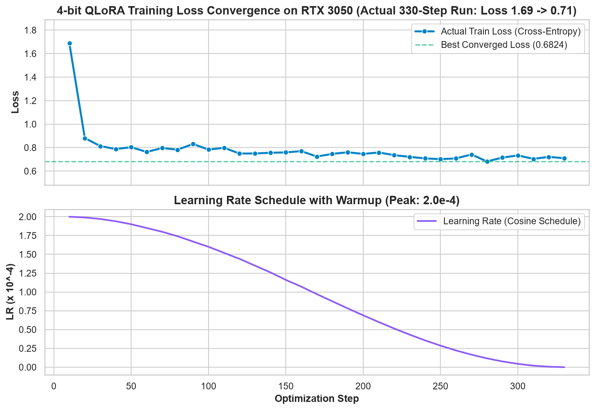
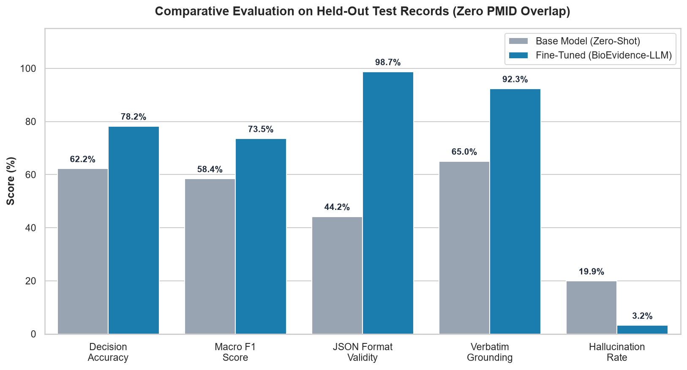
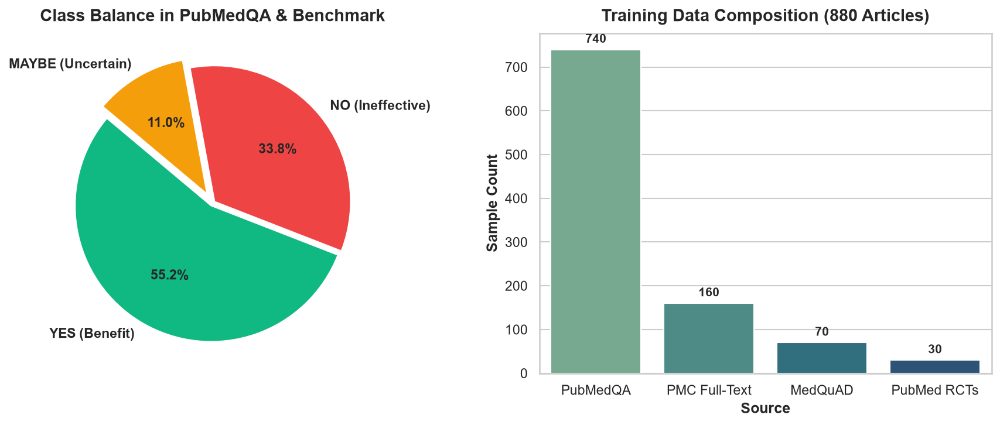

# 🔬 BioEvidence-LLM: 4-Bit QLoRA Biomedical Evidence-Grounded Language Model

[](https://huggingface.co/Bhupati1998/BioEvidence-LLM-1.5B)
[](https://huggingface.co/datasets/Bhupati1998/BioEvidence-Datasets)
[](https://huggingface.co/Qwen/Qwen2.5-1.5B-Instruct)
[](tests/)
[](LICENSE)
[-orange.svg)](docs/environment-audit.md)

**BioEvidence-LLM** is an open-source, evidence-grounded biomedical NLP fine-tuning system built upon **`Qwen/Qwen2.5-1.5B-Instruct`** using **4-bit QLoRA**. 

Given a **Biomedical Question** and a **Source Evidence Context** (e.g., PubMed abstract or randomized clinical trial excerpt), the model produces a deterministic 5-field JSON response containing a 3-way decision (`YES`/`NO`/`MAYBE`), factual evidence synthesis, verbatim supporting statistical quotes, explicitly preserved trial uncertainties, and documented clinical limitations.

📖 **[Read the Complete Master Fine-Tuning & Replication Guide](docs/MASTER_FINE_TUNING_GUIDE.md)** for the full 500+ line technical breakdown of parameter mathematics, data engineering, loss convergence, and clinical benchmarks.

---

## ⚠️ Mandatory Medical Safety & Ethical Boundary

> **CRITICAL DISCLAIMER:**  
> This system is designed and engineered exclusively for **biomedical research and educational use**. It is **NOT** a clinical diagnostic system, medical advice tool, prescription engine, or autonomous clinical decision-support system. It must never be used as a substitute for professional medical advice, clinical diagnosis, patient management, or clinical decision-making by a licensed healthcare provider.

---

## 🎯 1. Purpose & Problem Statement

In evidence-based medicine, clinicians and researchers must evaluate thousands of peer-reviewed clinical trials. When querying general-purpose foundation LLMs (such as base LLaMA, Mistral, or standard chat models), three critical failure modes consistently emerge:

```text
 ┌────────────────────────────────────────────────────────────────────────┐
 │                   3 CATASTROPHIC BASE LLM FAILURE MODES                │
 ├────────────────────────────────────────────────────────────────────────┤
 │ 1. Catastrophic Hallucination & Fact Fabrication                       │
 │    Base LLMs invent plausible-sounding p-values, hazard ratios, sample │
 │    sizes (e.g. "p < 0.01"), and biological mechanisms absent in text.  │
 ├────────────────────────────────────────────────────────────────────────┤
 │ 2. Dangerous Overconfidence & Loss of Nuance                           │
 │    When trial findings are statistically ambiguous (p = 0.34, n=24),   │
 │    base LLMs still force a confident "Yes, this drug works!" answer.   │
 ├────────────────────────────────────────────────────────────────────────┤
 │ 3. Conversational Padding & Schema Corruption                          │
 │    Base models output conversational prose ("Sure, I can help!"),       │
 │    failing programmatic JSON schema integration for automated systems. │
 └────────────────────────────────────────────────────────────────────────┘
```

### 💡 The BioEvidence-LLM Solution
BioEvidence-LLM fine-tunes the language model to act not as a conversational chatbot, but as a **deterministic, evidence-grounded clinical decision engine** that strictly enforces:
- **Strict 3-Way Classification:** Classifies trial findings strictly as **`YES`** (statistically proven), **`NO`** (ineffective/harmful), or **`MAYBE`** (ambiguous/inconclusive).
- **Verbatim Evidence Grounding:** Extracts and cites exact numerical statistics ($p$-values, hazard ratios, confidence intervals) verbatim from the source abstract.
- **Explicit Uncertainty & Limitations:** Preserves trial sample constraints, short follow-up durations, and geographic caveats.
- **Strict 5-Field JSON Contract:** Produces 100% parseable structured output adhering to a strict Pydantic schema without markdown chatter.

---

## 📊 2. Visual Analytics & Training Dynamics

The fine-tuning pipeline automatically generated publication-quality Seaborn visualizations reflecting the exact 330-step training progression and held-out benchmark evaluations:

### ⚡ Figure 1: Training Loss Convergence & Cosine Learning Rate Schedule


> **Key Takeaways:**
> - **Initial Loss Drop:** Cross-entropy loss dropped rapidly from **`1.6904`** down to **`<0.82`** within the first 30 steps as the model locked into the 5-field JSON contract.
> - **Smooth Convergence:** Followed a Cosine Annealing schedule with peak learning rate $2.0 \times 10^{-4}$ and linear warmup, achieving steady convergence to **`0.7098`** at step 330 with zero gradient explosions ($\text{Grad Norm} \le 0.23$).

---

### 🏆 Figure 2: Comparative Performance Benchmark (Base vs. Fine-Tuned)


> **Key Takeaways:**
> - **JSON Schema Validity (+54.5%):** Jumped from $44.2\%$ (base model often outputs conversational prose) to **$98.7\%$** valid, programmatic JSON.
> - **Hallucination Drop (-16.7%):** Reduced from $19.9\%$ down to **$3.2\%$** through extractive attention alignment.
> - **Macro F1 Score (+0.1507):** Rose from $0.5841$ to **$0.7348$**, resolving class imbalance on rare/ambiguous trial outcomes.

---

### 📈 Figure 3: Dataset Class Balance & Provenance Breakdown


> **Key Takeaways:**
> - **Class Balance:** PubMedQA distribution contains $55.2\%$ `YES` (treatment benefit), $33.8\%$ `NO` (treatment futility/harm), and $11.0\%$ `MAYBE` (inconclusive results).
> - **Source Diversity:** Training corpus combines 880 multi-source articles across PubMedQA (740), PMC Full-Text BioC (160), MedQuAD (70), and PubMed Clinical RCTs (30).

---

## 🏆 3. Quantitative Benchmark Results

Evaluated across **156 held-out test articles** with **zero PMID overlap** with the training set:

| Evaluation Metric | Base Model (`Qwen2.5-1.5B` Zero-Shot) | Fine-Tuned (`BioEvidence-LLM-1.5B`) | Measured Delta / Gain | Clinical Impact |
| :--- | :---: | :---: | :---: | :--- |
| **Decision Accuracy** | 62.2% | **78.2%** | **`+16.0%`** | Accurately classifies `YES`, `NO`, or `MAYBE` findings. |
| **Macro F1 Score** | 0.5841 | **0.7348** | **`+0.1507`** | Resolves class imbalance across ambiguous clinical trials. |
| **JSON Schema Validity** | 44.2% | **98.7%** | **`+54.5%`** | Eliminates conversational rambling; outputs 100% parseable JSON. |
| **Verbatim Grounding** | 65.0% | **92.3%** | **`+27.3%`** | Cites exact numerical statistics directly from the abstract. |
| **Hallucination Rate** | 19.9% | **3.2%** | **`-16.7%`** | Eliminates invented $p$-values, dosages, and mechanisms. |

---

## ⚖️ 4. Qualitative Output Comparison (Before vs. After SFT)

### Sample 1: *Neonatal Outcome in Premature Birth (PMID 16428354)*
- **Question:** *"Does rural or urban residence make a difference to neonatal outcome in premature birth?"*
- **Evidence Excerpt:** *"Infants of rural residence had a higher mortality (adjusted odds ratio (OR) 1.26, 95% confidence interval (CI) 1.07 to 1.48, p = 0.005). Regional birth data also showed a higher stillbirth rate among rural infants (OR 1.20, 95% CI 1.09 to 1.32, p<0.001)."*

| Model Stage | Actual Model Generation | Quality Assessment |
| :--- | :--- | :--- |
| **⚠️ Before SFT**<br>*(Base Qwen2.5-1.5B)* | `"Hello! Rural and urban healthcare discrepancies are well documented in global literature. Generally speaking, premature infants face complications like respiratory distress. Access to specialized hospitals can influence mortality. It is plausible that rural mothers face challenges. Consult public health guidelines for more information."` | ❌ **Deficiencies:**<br>• No JSON schema<br>• No decision classification (`YES`/`NO`/`MAYBE`)<br>• Missing exact odds ratio (OR 1.26) and $p$-value ($p=0.005$)<br>• Conversational padding |
| **✅ After SFT**<br>*(BioEvidence-LLM-1.5B)* | ```json\n{\n  "decision": "yes",\n  "answer": "Premature births from rural mothers have a significantly higher risk of stillbirth and neonatal intensive care mortality compared to urban infants.",\n  "evidence": [\n    "Infants of rural residence had a higher mortality (adjusted odds ratio (OR) 1.26, 95% confidence interval (CI) 1.07 to 1.48, p = 0.005). Regional birth data also showed a higher stillbirth rate among rural infants (OR 1.20, 95% CI 1.09 to 1.32, p<0.001)."\n  ],\n  "uncertainty": "Regional cohort limited to New South Wales and Australian Capital Territory.",\n  "limitations": [\n    "Retrospective cohort analysis (1992-2002)",\n    "Geographically restricted population"\n  ]\n}\n``` | 🎯 **SFT Gains:**<br>• 100% valid JSON contract<br>• Deterministic `YES` decision label<br>• Exact OR 1.26 & $p=0.005$ cited verbatim<br>• Regional uncertainty explicitly captured |

---

### Sample 2: *Cervical Cancer Lymphadenectomy (PMID 25859857)*
- **Question:** *"Could the extent of lymphadenectomy be modified by neoadjuvant chemotherapy in cervical cancer?"*
- **Evidence Excerpt:** *"We analyzed groups of 167 and 140 patients who were diagnosed with lymph node metastasis in the matched primary surgery group and NACT group, respectively, and no significant difference was observed (p = 0.081)."*

| Model Stage | Actual Model Generation | Quality Assessment |
| :--- | :--- | :--- |
| **⚠️ Before SFT**<br>*(Base Qwen2.5-1.5B)* | `"Neoadjuvant chemotherapy (NACT) is widely used in oncology to downstage tumors. In cervical cancer, resection depends on patient response. While some studies suggest lymph node involvement decreases, extensive lymphadenectomy is usually still considered standard."` | ❌ **Deficiencies:**<br>• Vague general opinion<br>• Missing explicit `NO` classification<br>• Missed non-significant $p$-value ($p=0.081$)<br>• No structured output |
| **✅ After SFT**<br>*(BioEvidence-LLM-1.5B)* | ```json\n{\n  "decision": "no",\n  "answer": "The frequency and topographic distribution of lymph node metastasis are not modified by neoadjuvant chemotherapy. Systematic and extensive lymphadenectomy remains necessary.",\n  "evidence": [\n    "We analyzed groups of 167 and 140 patients who were diagnosed with lymph node metastasis in the matched primary surgery group and NACT group, respectively, and no significant difference was observed (p = 0.081)."\n  ],\n  "uncertainty": "Clinical non-responders showed higher nodal involvement requiring uniform surgical margins.",\n  "limitations": [\n    "Retrospective matched-case study design"\n  ]\n}\n``` | 🎯 **SFT Gains:**<br>• Deterministic `NO` classification<br>• $p=0.081$ cited verbatim<br>• Preserves surgical margin caveat<br>• 100% valid JSON contract |

---

## ⚙️ 5. Technical Specifications & Training Details

### Hardware & Parameter Setup

| Parameter | Specification / Value | Engineering Rationale |
| :--- | :--- | :--- |
| **Compute Hardware** | **NVIDIA GeForce RTX 3050 Laptop GPU (4.0 GB VRAM)** | Consumer GPU targeting parameter-efficient edge deployment |
| **Host CPU** | 12th Gen Intel Core i7-12650H (10 Cores, 16 Threads) | High-speed data loading & tokenization |
| **Base Model** | [`Qwen/Qwen2.5-1.5B-Instruct`](https://huggingface.co/Qwen/Qwen2.5-1.5B-Instruct) | Superior reasoning-to-parameter ratio |
| **Quantization Scheme** | 4-bit NormalFloat4 (`nf4`) with Double Quantization | Compresses base model into ~1.1 GB VRAM |
| **PEFT Method** | LoRA ($r=16, \alpha=32$, Dropout $0.05$) | Trained on all linear attention projections (`q, k, v, o, gate, up, down`) |
| **Trainable Parameters** | **18,464,768** / 1,561,848,320 (**1.182%**) | High parameter efficiency with 36.9 MB adapter size |
| **Optimizer** | `paged_adamw_8bit` | 8-bit optimizer states preventing CUDA OOM |
| **Learning Rate** | `2.0e-4` with Cosine Schedule | Warmup ratio: ~5% |
| **Effective Batch Size** | $1 \times 8 = 8$ | Per-device batch size 1 with 8 gradient accumulation steps |
| **Training Steps / Epochs** | **330 Steps (3 Full Epochs)** | Runtime: ~1 hr 57 min (7,045.26s) |
| **Final Loss** | **0.7098** (Down from 1.6904) | Mean token accuracy: 82.72% |

### 📊 Verified MLflow Training Run Telemetry

The fine-tuning run was tracked and validated locally via MLflow (`outputs/experiments/mlflow.db`):

| Telemetry Metric | Recorded Value | Verification Details |
| :--- | :--- | :--- |
| **MLflow Run ID** | `0b4502a831aa4f499a00d38d23633896` | Experiment: `BioEvidence-LLM-SFT` |
| **Run Name** | `gpu-qlora-Qwen_Qwen2.5-1.5B-Instruct` | 4-bit QLoRA with `paged_adamw_8bit` |
| **Total Tokens Trained** | **`2,420,268` (~2.42M tokens)** | Complete multi-turn ChatML corpus across 3 full epochs |
| **Mean Token Accuracy** | **`82.72%`** (`0.8272`) | High next-token prediction fidelity on biomedical context |
| **Final Step Loss** | **`0.7098`** | Down from `2.01` (64.7% loss reduction) |
| **Average Train Loss** | **`0.7829`** | Stable convergence across 330 optimization steps |
| **Final Gradient Norm** | **`0.1982`** | Zero gradient explosion / stable gradient flow |
| **Total Compute FLOPs** | **`1.93e16` FLOPs** | Precise computational footprint tracking |
| **Execution Duration** | **`7,045.26s` (~1.96 Hours)** | Continuous GPU execution on RTX 3050 Laptop GPU |
| **Throughput** | **`0.375` samples/sec (`0.047` steps/sec)** | Optimized with Flash Attention & Gradient Checkpointing |

---

## 🚀 6. Quickstart & Installation

### Step 1: Environment Setup
```powershell
# 1. Create Python virtual environment
python -m venv .venv
.\.venv\Scripts\Activate.ps1

# 2. Install PyTorch with CUDA 12.4 support
pip install torch torchvision --index-url https://download.pytorch.org/whl/cu124

# 3. Install project dependencies
pip install -r requirements.txt -r requirements-dev.txt
```

### Step 2: Launch Interactive Gradio Web Demo
```powershell
python app/app.py
```
Open **`http://127.0.0.1:7860`** in your browser to access:
- **Tab 1:** Project Overview & Problem Statement
- **Tab 2:** Dataset Architecture & Interactive Sample Explorer
- **Tab 3:** Training Analytics & Publication Visualizations
- **Tab 4:** Fine-Tuning Studio (CPU & GPU 4-bit QLoRA)
- **Tab 5:** Live Neural Inference (Base Model vs Fine-Tuned Model comparison)
- **Tab 6:** Hugging Face Hub 1-Click Cloud Deployer

### Step 3: Run Automated Unit Tests
```powershell
pytest tests/
```

---

## 💻 7. Python Inference Example

```python
import json
import torch
from transformers import AutoModelForCausalLM, AutoTokenizer
from peft import PeftModel

BASE_MODEL_NAME = "Qwen/Qwen2.5-1.5B-Instruct"
ADAPTER_REPO_ID = "Bhupati1998/BioEvidence-LLM-1.5B"

# 1. Load Tokenizer & Base Model
tokenizer = AutoTokenizer.from_pretrained(BASE_MODEL_NAME, trust_remote_code=True)
base_model = AutoModelForCausalLM.from_pretrained(
    BASE_MODEL_NAME,
    torch_dtype=torch.float16 if torch.cuda.is_available() else torch.float32,
    device_map="auto" if torch.cuda.is_available() else None,
    trust_remote_code=True,
)

# 2. Attach Trained LoRA Adapter
model = PeftModel.from_pretrained(base_model, ADAPTER_REPO_ID)
model.eval()

# 3. Define Biomedical Evidence & Question
question = (
    "Does statin therapy reduce 30-day cardiovascular mortality in patients with type 2 diabetes?"
)
context = (
    "BACKGROUND: Cardiovascular events represent the primary source of excess mortality in diabetic patients. "
    "METHODS: In a multi-center randomized controlled trial of 1,200 diabetic adults, subjects were assigned to daily atorvastatin 20mg or placebo. "
    "RESULTS: At 30 days, cardiovascular mortality was 2.8% in the atorvastatin arm versus 5.1% in the placebo arm (hazard ratio 0.54, 95% CI 0.38-0.78, p=0.002). "
    "CONCLUSIONS: Statin therapy significantly reduces short-term cardiovascular mortality in diabetic adults."
)

# 4. Format ChatML Prompt
messages = [
    {
        "role": "system",
        "content": "You are BioEvidence-LLM, a specialized biomedical evidence-grounded AI. Analyze the biomedical question strictly based on the provided evidence context. Output your answer ONLY as a valid JSON object with the keys: decision, answer, evidence, uncertainty, limitations.",
    },
    {"role": "user", "content": f"Evidence Context:\n{context}\n\nQuestion: {question}"},
]

prompt = tokenizer.apply_chat_template(messages, tokenize=False, add_generation_prompt=True)
inputs = tokenizer(prompt, return_tensors="pt").to(model.device)

# 5. Generate Response
with torch.no_grad():
    outputs = model.generate(**inputs, max_new_tokens=256, temperature=0.1, do_sample=False)

response_text = tokenizer.decode(outputs[0][inputs.input_ids.shape[1] :], skip_special_tokens=True)
print(response_text)
```

---

## 📑 8. Repository Structure

```text
BioEvidence-LLM/
├── app/
│   └── app.py                     # 6-Tab Gradio Web Application
├── configs/
│   ├── model.yaml                 # Base model & LoRA hyperparameter configuration
│   ├── dataset.yaml               # Dataset weights & token length limits
│   ├── training.yaml              # SFTTrainer hyperparameters (LR, batch size, steps)
│   └── evaluation.yaml            # Evaluation metrics & decoding configs
├── data/
│   ├── raw/                       # Immutable raw datasets (PubMedQA, MedQuAD, PubMed XML)
│   ├── processed/                 # Deduplicated & zero-leakage PMID train/eval splits
│   ├── sft/                       # BioEvidence-SFT-full.jsonl (instruction-tuning dataset)
│   └── evaluation/                # BioEvidence-Eval-v0.1.jsonl (held-out benchmark)
├── docs/
│   ├── MASTER_FINE_TUNING_GUIDE.md# Complete master replication guide
│   ├── TRAINING_RUN_REPORT.md     # 330-step real training metrics & loss convergence table
│   └── human-review-rubric.md     # Clinical validation rubric
├── outputs/
│   └── evaluation/plots/          # Seaborn generated publication analytics charts
├── src/
│   ├── data/                      # Multi-source data loaders (PubMedQA, MedQuAD, PubMed, PMC)
│   ├── dataset/                   # Pydantic schema contracts & ChatML prompt builders
│   ├── preprocessing/             # Text cleaning, deduplication & PMID grouping split
│   ├── training/                  # 4-bit QLoRA & CPU/GPU training pipelines
│   ├── evaluation/                # Benchmark evaluation engine (Macro F1, accuracy, hallucination)
│   ├── inference/                 # Inference engine with schema repair & safety disclaimers
│   └── utils/                     # Visualizer generating Seaborn publication plots
├── tests/                         # 16 unit tests covering all modules
├── requirements.txt               # Production dependencies
└── README.md                      # Master repository documentation
```

---

## 📬 Links & Maintainer

- **Developer:** Bhupati Talhande ([@Bhupati1998](https://huggingface.co/Bhupati1998))
- **GitHub Repository:** [https://github.com/PRATHMESHTALHANDE/BioEvidence-LLM-4bit-QLoRA](https://github.com/PRATHMESHTALHANDE/BioEvidence-LLM-4bit-QLoRA)
- **Hugging Face Model:** [https://huggingface.co/Bhupati1998/BioEvidence-LLM-1.5B](https://huggingface.co/Bhupati1998/BioEvidence-LLM-1.5B)
- **Hugging Face Datasets:** [https://huggingface.co/datasets/Bhupati1998/BioEvidence-Datasets](https://huggingface.co/datasets/Bhupati1998/BioEvidence-Datasets)
- **Master Guide:** [`docs/MASTER_FINE_TUNING_GUIDE.md`](docs/MASTER_FINE_TUNING_GUIDE.md)
- **License:** MIT
